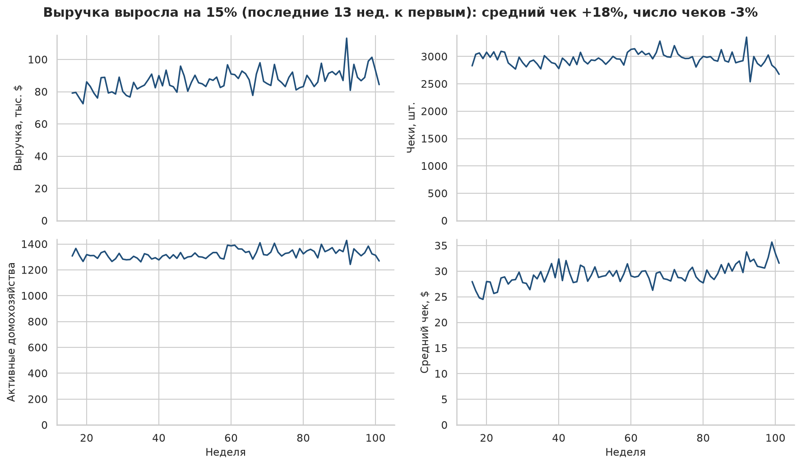
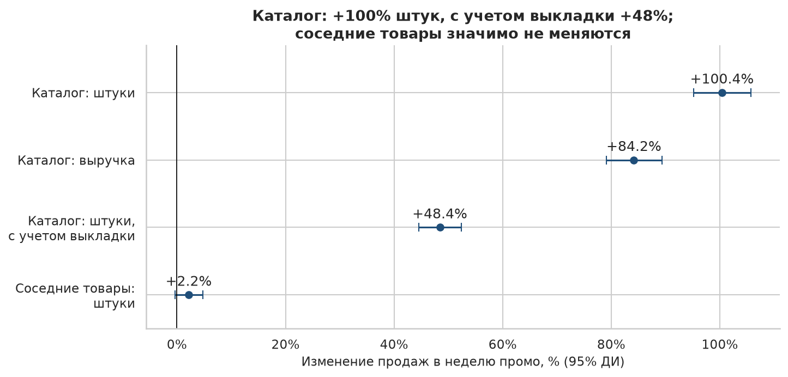

# Ad-hoc анализ покупок сети супермаркетов

Четыре бизнес-вопроса о продажах, клиентах, удержании и промо на открытых данных dunnhumby «The Complete Journey»: SQL поверх Parquet, PySpark для подготовки, DiD-оценка эффекта каталога.

## Ключевые выводы

Все числа взяты из [`reports/results.json`](reports/results.json), который генерирует пайплайн. Подробности — в отчете [`notebooks/report.ipynb`](notebooks/report.ipynb).

1. **Выручка растет за счет среднего чека, а не трафика.** Последние 13 недель против первых 13: выручка +15%, средний чек +18%, число чеков −3%, активных домохозяйств +2%. Рекомендация: разложить рост чека на цену и количество товаров и отдельно ставить цели по частоте визитов.
2. **Выручка сконцентрирована у ядра клиентов.** 20% домохозяйств с наибольшими тратами дают 54% выручки; сегмент «Чемпионы» — 21% клиентов и 46% выручки. Сегмент «Под угрозой ухода» (13% клиентов, 13% выручки) — первый кандидат на реактивацию.
3. **Удержание высокое и не снижается.** В следующем 4-недельном периоде покупает 80% когорты, через год (13 периодов) — 81%. В этой панели главный рычаг — частота и чек активной базы, а не возврат ушедших.
4. **70 из 491 лояльных домохозяйств уходят.** За последние 12 недель число чеков у них упало на 75%, доля в выручке — с 6.5% до 2.1%. До ухода у них был ниже средний чек (медиана 28.4 $ против 40.1 $ у стабильных лояльных). Рекомендация: триггерная кампания, когда частота покупок лояльного клиента падает вдвое к его собственной норме.
5. **Каталог связан с ростом продаж товара в неделю промо на +100% в штуках (95% ДИ 95–106%) и +84% в выручке**, но 90% товаров каталога в ту же неделю стоят в выкладке (в контроле — 45%). С поправкой на выкладку эффект +48% (95% ДИ 45–52%). Значимой каннибализации соседних товаров подкатегории нет: +2.2% (95% ДИ от −0.4% до +4.8%). Рекомендация: оценивать каталог и выкладку как связку и проверить их раздельный эффект A/B-тестом на магазинах.





## Бизнес-вопросы

1. **Как устроен бизнес?** Недельная динамика выручки, числа чеков, активных клиентов и среднего чека; топ отделов (`DEPARTMENT`) и товарных категорий (`COMMODITY_DESC`) по выручке.
2. **Какие есть клиентские сегменты?** RFM-сегментация домохозяйств и доля выручки каждого сегмента.
3. **Как удерживаются клиенты?** Когортный анализ удержания по неделе первой покупки.
4. **Работают ли промоакции?** Прирост продаж от размещения товара в каталоге (difference-in-differences) и каннибализация соседних товаров той же подкатегории.

Отдельно: **уходящие лояльные клиенты** — сколько их, какую долю выручки они давали и чем отличаются.

## Данные

**Источник:** dunnhumby «The Complete Journey», зеркало на Mendeley Data, лицензия CC BY 4.0: <https://doi.org/10.17632/7myy93ym6k.1>. Покупки 2 500 домохозяйств за 711 дней (102 недели).

| Таблица | Строк | Что внутри |
|---|---|---|
| `transaction_data` | 2 595 732 | позиции чеков: `household_key`, `basket_id`, `day`, `week_no`, `product_id`, `quantity`, `sales_value`, `store_id`, скидки |
| `product` | 92 353 | справочник товаров: `department`, `commodity_desc`, `sub_commodity_desc`, `brand` |
| `hh_demographic` | 801 | демография части домохозяйств |
| `causal_data` | 36 786 524 | размещение товара в каталоге (`mailer`) и выкладке (`display`) по магазину и неделе |

**Ключевые поля и особенности:**

- Календарных дат нет: время задано номером дня `day` (1–711) и недели `week_no` (1–102). Анализ ведется по неделям.
- Выручка — `sales_value`, чек — уникальный `basket_id`.
- Строки с `quantity = 0` или `sales_value <= 0` исключаются: 14 466 и 4 451 строк, вместе 0.73% таблицы чеков. Полных дубликатов нет. После очистки 275 539 чеков, 91 905 товаров в продажах, 581 магазин.
- **Начало выборки неполное.** Домохозяйства входят в панель постепенно: в неделе 1 активны 87 домохозяйств. Окно анализа начинается с недели 16 — первой, после которой число активных домохозяйств не опускается ниже 90% медианы (1 179 домохозяйств). Последняя неделя 102 неполная, поэтому окно заканчивается неделей 101. Когорты строятся по всем неделям до 101, потому что когорта определяется первой покупкой.
- Проверки качества: пропусков в ключевых полях нет, все `product_id` из чеков есть в справочнике, недели в диапазоне 1–102 (`causal_data` покрывает недели 9–101). Некритичная находка: у 15 товаров справочника нет категорий, но ни один из них не продавался.

## Методология

**Бизнес-метрики.** `sql/01_weekly_kpi.sql` считает недельные выручку, чеки, активных домохозяйств и средний чек с изменением к прошлой неделе (`LAG`). `sql/02_category_share.sql` считает доли отделов и товарных категорий (`SUM() OVER`, `ROW_NUMBER`). Тренд — отношение средних значений последних и первых 13 недель окна.

**RFM-сегменты.** `sql/03_rfm.sql`: Recency — недель от последней покупки до конца окна, Frequency — число чеков, Monetary — выручка за окно. Баллы 1–5 по квинтилям через `NTILE(5)`, 5 — лучшее значение. Сегмент — первое подходящее правило сверху вниз (правила в `config.yaml`):

| Сегмент | R | F | M | Домохозяйств | Доля выручки |
|---|---|---|---|---|---|
| Чемпионы | 4–5 | 4–5 | 4–5 | 21% | 46% |
| Лояльные | 3–5 | 3–5 | 1–5 | 26% | 29% |
| Перспективные | 4–5 | 1–2 | 1–5 | 7% | 3% |
| Под угрозой ухода | 1–2 | 3–5 | 1–5 | 13% | 13% |
| Спящие | 1–2 | 1–2 | 1–5 | 27% | 7% |
| Середняки | остальные | | | 6% | 2% |

**Когорты.** `sql/04_cohorts.sql`: когорта — 4-недельный период первой покупки (`MIN() OVER`); удержание — доля домохозяйств когорты с покупкой в каждом следующем периоде. Используются только полные периоды, когорты меньше 50 домохозяйств отброшены (осталось 5 когорт, 2 488 домохозяйств). Все они — первые недели наблюдения, поэтому когорта здесь означает вход в панель, а не привлечение нового клиента.

**Уходящие лояльные.** `sql/05_churning_loyal.sql`: лояльный — в верхних 20% домохозяйств по выручке за первую половину окна (недели 16–58). Уходящий — лояльный, у которого число чеков за последние 12 недель меньше половины его же среднего числа чеков за 12-недельный блок в предыдущей части окна. Группа сравнивается со стабильными лояльными по среднему чеку (тест Манна–Уитни), структуре корзины по отделам (с поправкой Бонферрони) и демографии (χ², только если ожидаемые частоты не меньше 5).

**Эффект промо (stacked difference-in-differences).** Воздействие — товар в каталоге (`mailer` не равен `0`) не менее чем в половине магазинов в неделю промо и ни разу за 4 предыдущие недели. Контроль — товары той же подкатегории (`sub_commodity_desc`), не бывшие в каталоге во всем окне. Окно — 4 недели до промо и неделя промо; в выборку входят только товары с продажами во все 4 предпромо-недели. Модель `log(1 + продажи) ~ treated × post` с фиксированными эффектами товара и недели внутри каждого события, стандартные ошибки кластеризованы по товару (statsmodels). Параллельность трендов проверяется графиком средних продаж групп и event-study-коэффициентами по неделям до промо. Каннибализация оценивается так же: «воздействие» — непромо-товары подкатегории, где вышло промо, контроль — товары других подкатегорий той же товарной категории без промо. Топливо и прочие операции (`KIOSK-GAS`, `MISC SALES TRAN`) исключены: там `quantity` — не штуки.

## Структура проекта

```
.
├── config.yaml              # пути, пороги и параметры всех анализов
├── Makefile                 # цели пайплайна: download, prepare, quality, analyze, report, test, lint, all, clean
├── pyproject.toml           # зависимости с точными версиями
├── data/                    # сырые CSV и Parquet, не коммитится
├── sql/                     # SQL-запросы для DuckDB, по одному на вопрос
├── src/retail_analysis/     # пакет: загрузка, подготовка на PySpark, проверки качества, анализы, графики
├── notebooks/report.ipynb   # итоговый отчет с выводами
├── reports/                 # results.json со всеми числами и PNG-графики
└── tests/                   # pytest на синтетических данных, без Spark и реальных данных
```

## Как запустить

Нужны Python 3.11, Java 17 для PySpark и [uv](https://docs.astral.sh/uv/). Kaggle-токен не нужен: файлы скачиваются по прямым ссылкам с Mendeley Data и сверяются по SHA-256.

```
uv sync
make download
make all
```

Вариант через pip (тогда Makefile запускает команды в текущем окружении):

```
pip install -e ".[dev]"
make download RUN=
make all RUN=
```

`make download` скачивает около 0.8 ГБ. `make all` после загрузки занимает около 2 минут на MacBook с Apple Silicon, дольше всего идет подготовка `causal_data` на PySpark. `make clean` удаляет `data/processed/` и `reports/`.

## Стек

Python 3.11, PySpark 3.5 (подготовка и Parquet), DuckDB (SQL поверх Parquet), pandas, numpy, statsmodels (DiD-регрессия), scipy (статистические тесты), matplotlib и seaborn (графики), Jupyter (отчет), pytest, ruff. Дополнительно: pyarrow — чтение Parquet в pandas, PyYAML — чтение `config.yaml`, uv — фиксация окружения через `uv.lock`.

## Ограничения

- **Панель, а не вся база.** 2 500 домохозяйств отобраны из частых покупателей, поэтому удержание и доли сегментов нельзя переносить на всех клиентов сети. Для всей базы это верхняя граница удержания.
- **Нет календаря.** Только номера дней и недель, поэтому сезонность и праздники явно не учитываются.
- **Промо назначается не случайно.** В каталог ставят товары, на которые ожидается спрос. DiD убирает постоянные различия между товарами, но не решение поставить товар в каталог именно сейчас. Совместный тест отвергает параллельность предпромо-трендов (p = 4e-07): максимальное отклонение до промо — 4.7%, поэтому оценка может быть завышена на несколько процентных пунктов.
- **Одновременные акции.** Каталог почти всегда совпадает с выкладкой и, вероятно, со скидкой. Цены до скидки для всех товаров нет, поэтому эффект каталога нельзя отделить от эффекта цены.
- **Продажи только панели.** Продажи товара считаются по покупкам 2 500 домохозяйств, а не по всем чекам магазинов; малопродаваемые товары не проходят фильтр доступности.
- **Демография анонимизирована** (`classification_1`–`classification_5`) и есть только у 801 домохозяйства, из уходящих лояльных — у 30. Надежного χ²-теста не получилось ни для одного признака.
